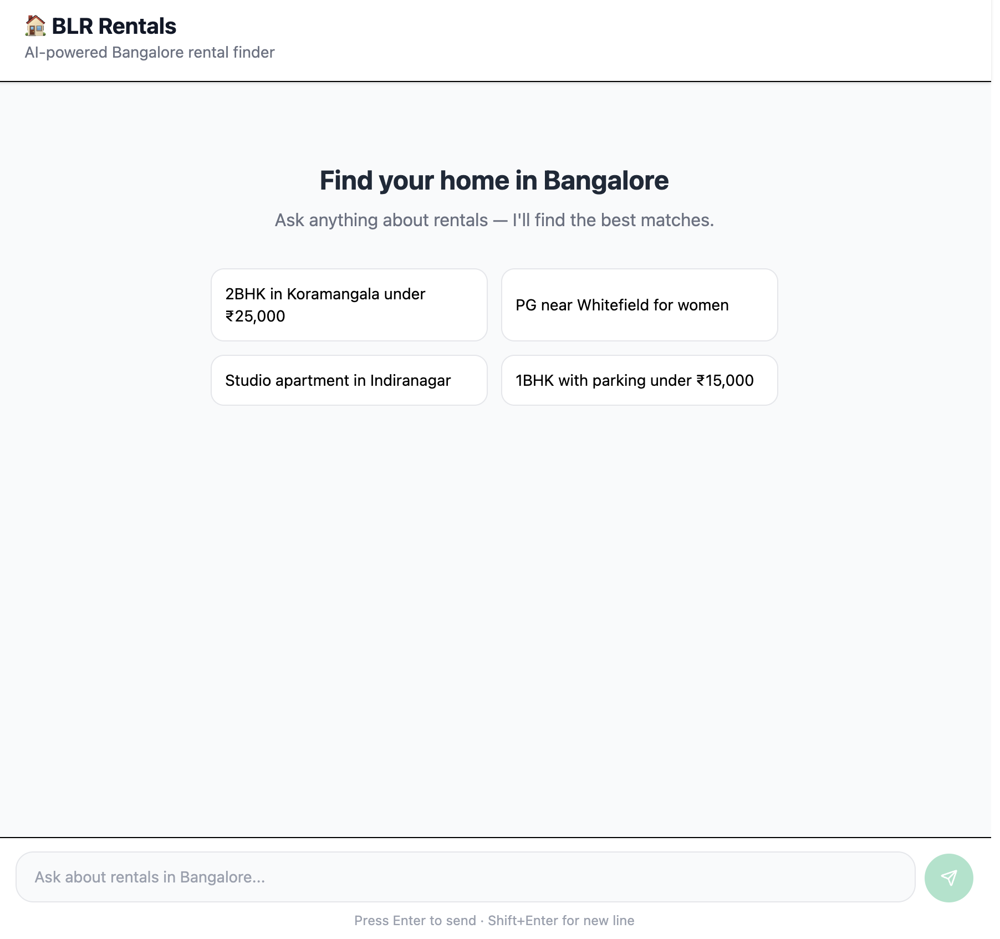
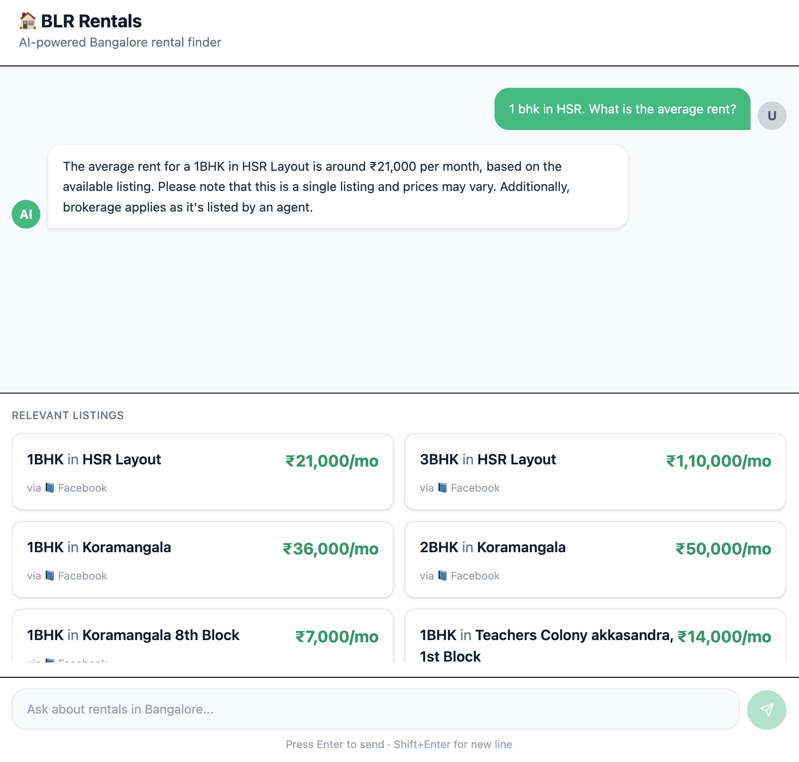

# BLR Rentals
**An AI-powered rental properties finder for Bengaluru.**

BLR Rentals is a full-stack portfolio project designed to aggregate scattered rental listings from major real-estate portals and community forums. It transforms unstructured web data into a searchable, conversational database using **Headless Browser Automation**, **LLMs** for data extraction, and **Vector Embeddings**.

---

## Tech Stack

### **Backend**
* **FastAPI:** High-performance Python web framework for the core API.
* **Playwright:** Headless browser automation to navigate and scrape JavaScript-heavy SPAs (Single Page Applications).
* **Groq (Llama 3):** Ultra-fast LLM inference used to parse messy, unstructured scraped text into clean JSON.
* **Ollama:** Local vector embedding generation (using `nomic-embed-text`) running on Apple Silicon (Metal).
* **PostgreSQL + pgvector:** Relational database with specialized vector similarity search for RAG (Retrieval-Augmented Generation).

### **Frontend**
* **React + Vite:** Modern, fast build tool and library for the user interface.
* **Tailwind CSS:** Utility-first styling for a clean, responsive "Bangalore-centric" design.

---

##  Key Features

* **Multi-Locality Targeting:** Specialized scrapers for high-demand hubs
* **Conversational Search:** Instead of rigid filters, users can chat: *"Find me a semi-furnished 1BHK in HSR for under 25k near a park."*

## Snippets

